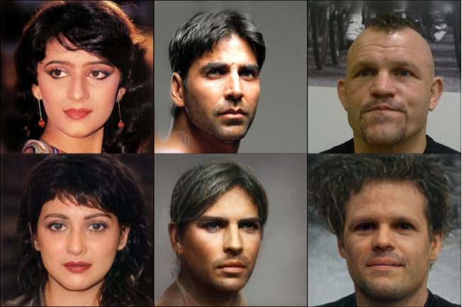
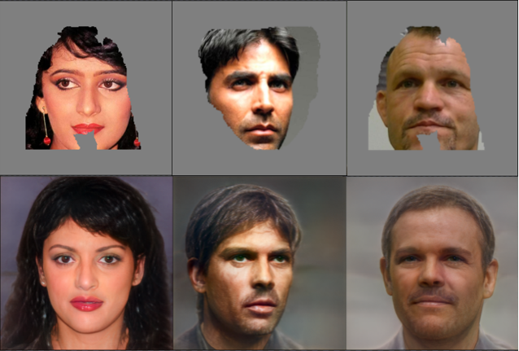

# pSp Framework - UnOfficial PyTorch Implementation

### Encoding in Style: a StyleGAN Encoder for Image-to-Image Translation

Paper : ***https://arxiv.org/pdf/2008.00951.pdf***

## Environment
Fix Docker-compose.yml's volumes.
```
$ docker-compose up -d
```

## Train
Download pkl file in [here](https://github.com/NVlabs/stylegan2).

Convert pkl file(tensorflow) to pt file(torch).
```
$ python convert_weight.py <path to pkl file> --gen --disc
```

```
$ python -m torch.distributed.launch --nproc_per_node=4 --master_port=8800 train.py --batch 3 --ckpt config/stylegan2-ffhq-config-f.pt --path /data/
```

## Infer
Add images for inference in test folder.
```
$ python infer_enc.py --ckpt ...
```

## Result
### FFHQ Inversion


### FFHQ Inpainting


### Reference
https://github.com/rosinality/stylegan2-pytorch  
https://github.com/S-aiueo32/lpips-pytorch  
https://github.com/TreB1eN/InsightFace_Pytorch
